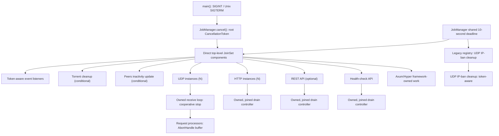

# Task Inventory

## Purpose and Scope

This is the implementation-time task-ownership evidence for the production
tracker, revalidated for [issue #1588][issue-1588] after [issue #1586][issue-1586]
adopted direct `JoinSet` supervision. It follows the normal `app::start()`
startup path and excludes tests, benchmarks, the tracker-client application,
and third-party framework internals whose exact task topology is not exposed.

`main()` is the executable signal boundary: it accepts `SIGINT` and, on Unix,
`SIGTERM`; it then calls `JobManager::cancel()` and awaits all manager-owned
work under one shared ten-second deadline. The supervisor owns direct
top-level component futures only. Components own nested tasks and must join or
deliberately abort them before returning; `JobManager` never collects nested
handles.

## Conceptual Ownership Tree

Tokio tasks have no process IDs. This conceptual tree represents task creation
and supervision ownership, not operating-system parent-child relationships.
`N` means one task per matching configured item.

```text
torrust-tracker process (Tokio runtime; main)
└─ app::start() / start_jobs()
   └─ JobManager
      ├─ Direct JoinSet components
      │  ├─ seven token-aware event-listener categories [conditional as listed below]
      │  ├─ torrent cleanup [conditional]
      │  ├─ peers inactivity update [conditional]
      │  ├─ UDP instance [N configured public bindings; component child token]
      │  │  └─ receive loop [component-owned OwnedTask; stops cooperatively on cancellation]
      │  │     └─ request processors [N datagrams; bounded AbortHandle buffer]
      │  ├─ HTTP instance [N configured bindings; component child token]
      │  │  ├─ server task [component-owned TokenAwareServerTask]
      │  │  └─ drain controller [component-owned and joined]
      │  ├─ REST API [conditional; component child token]
      │  │  ├─ server task [component-owned TokenAwareServerTask]
      │  │  └─ drain controller [component-owned and joined]
      │  └─ health-check API [always; component child token]
      │     ├─ server task [component-owned TokenAwareServerTask]
      │     └─ drain controller [component-owned and joined]
      ├─ Legacy registry (pre-spawned periodic jobs, not JoinSet members)
      │  └─ UDP IP-ban cleanup [conditional; CancellationToken]
      └─ Axum/Hyper connection and request work [framework-owned]
```



## Current Inventory

The table is a compact overview. The [detailed inventory](#detailed-inventory)
below records the exact ownership, cancellation, and completion evidence for
each row.

| Work                          | Cardinality | Ownership        | Current shutdown         | Roadmap                |
| ----------------------------- | ----------- | ---------------- | ------------------------ | ---------------------- |
| Swarm-registry listener       | 0–1         | Direct `JoinSet` | Root token               | —                      |
| Tracker-core listeners        | 0–2         | Direct `JoinSet` | Root token               | —                      |
| HTTP-core listener            | 1           | Direct `JoinSet` | Root token               | —                      |
| UDP-core listener             | 1           | Direct `JoinSet` | Root token               | —                      |
| UDP-server listeners          | 0–2         | Direct `JoinSet` | Root token               | —                      |
| UDP instances                 | N bindings  | Direct `JoinSet` | Child token              | SI-14 complete         |
| UDP request processors        | N datagrams | Component-owned  | Abort handles            | SI-15                  |
| HTTP instances                | N bindings  | Direct `JoinSet` | Child token              | SI-11 complete         |
| REST API                      | 0–1         | Direct `JoinSet` | Child token              | SI-12 complete         |
| Health-check API              | 1           | Direct `JoinSet` | Child token              | SI-13 complete, SI-21  |
| HTTP/REST drain controllers   | Per server  | Component-owned  | Child token, 90 s drain  | SI-11, SI-12 complete  |
| Health-check drain controller | 1           | Component-owned  | Child token, 5 s drain   | SI-13 complete         |
| Health-check request work     | Per request | Framework-owned  | Request lifetime         | —                      |
| Torrent cleanup               | 0–1         | Direct `JoinSet` | Root token               | SI-4 complete          |
| Peers inactivity update       | 0–1         | Direct `JoinSet` | Root token               | SI-5 complete          |
| UDP IP-ban cleanup            | 0–1         | Legacy registry  | Root token               | Periodic-job migration |

## Detailed Inventory

### Direct `JoinSet` Components

- **Torrent cleanup** — starts when `inactive_peer_cleanup_interval > 0`. Its
  unspawned runner observes the root token or weak-manager expiry and reports
  cooperative cancellation or normal completion to `JobManager`.
- **Peers inactivity update** — starts when `tracker_usage_statistics` is
  enabled. Its unspawned runner observes the root token or weak registry or
  statistics-repository expiry and reports cooperative cancellation or normal
  completion to `JobManager`.
- **Swarm-registry statistics listener** — starts only when
  `tracker_usage_statistics` is enabled. Its unspawned runner receives the
  root token and reports either cooperative cancellation or completion.
- **Tracker-core listeners** — the in-memory listener starts with
  `tracker_usage_statistics`; the persistent completed-statistics listener
  starts when persistent completed statistics are enabled and fails startup if
  persistence is absent. Both are token-aware direct components.
- **HTTP-core and UDP-core listeners** — each starts exactly once, even when
  the corresponding server bindings are absent. Both are token-aware direct
  components.
- **UDP-server statistics and banning listeners** — each starts when UDP
  services are enabled: the tracker is public and the UDP configuration is
  non-empty. Both are token-aware direct components.
- **UDP instances** — one direct component per enabled UDP binding, each with
  a child of the `JobManager` root token. The component owns the receive loop
  through `OwnedTask`, created before the component future is returned, and
  aborts it if dropped. The loop observes the token between datagrams and
  returns `Ok(())`, so the component reports cooperative cancellation; a
  receive error or panic fails the component (SI-14).
- **HTTP instances and REST API** — direct components with a child token each.
  They own their server task and token-aware drain controller through
  `TokenAwareServerTask` and join both after cancellation or independent
  server completion. There is one HTTP component per configured binding and
  zero or one REST component when `http_api` is configured (SI-11, SI-12).
- **Health-check API** — an always-present direct component that receives a
  child of the `JobManager` root token. It owns both the server and its
  token-aware drain controller through `TokenAwareServerTask`; it joins both
  after cancellation or independent server completion and aborts them if
  dropped. The drain has a 5-second budget (SI-13).

### Component-Owned, Detached, and Framework-Owned Work

- **UDP request processors** — the receive loop spawns one per datagram and
  retains only a bounded `AbortHandle` buffer. Eviction and buffer drop abort
  unfinished processors, but no processor terminal result is collected. Each
  processor holds a clone of the socket `Arc`, so the socket closes once the
  runtime drops the aborted processors (SI-15).
- **HTTP and REST drain controllers** — each token-aware server spawns a
  controller that waits for its component token, then drains for up to 90
  seconds. The component joins it before reporting its outcome; the 90-second
  budget still exceeds the manager's shared ten-second deadline (SI-20).
- **Health-check request work** — request-scoped aggregation awaits with
  `join_all`; protocol probes are spawned inside service checks. Axum/Hyper
  own connection and request topology, so none of this work is manager-owned.

### Legacy Registry

- **UDP IP-ban cleanup** — starts with UDP services. Its pre-spawned legacy
  handle observes the root token; the manager waits for it or aborts and joins
  it at the deadline.

The direct-component count is configuration dependent:

$$
3 + I_{cleanup} + 2I_{usage} + I_{persistent} + I_{udp}(2 + N_{udp}) + N_{http} + I_{api}
$$

The constant three represents the HTTP-core listener, UDP-core listener, and
health-check API. Torrent cleanup is conditional on its cleanup interval. The
sole legacy job is separately conditional as shown above.

## Findings and Roadmap Mapping

1. The #1586 supervisor boundary is present: direct top-level component
  futures enter `JoinSet`; component child handles do not. The pre-spawned UDP
  IP-ban cleanup job remains the sole deliberately narrow compatibility
  registry entry under the same process-wide deadline.
2. `main.rs` now handles Unix `SIGTERM` at the executable boundary. SI-1 is
   complete, so this is not an open gap.
3. `peers_inactivity_update` is a direct token-aware component after SI-5. It
  observes `jobs.cancel()` and reports cooperative cancellation; torrent
  cleanup is a direct token-aware component after SI-4.
4. The production tracker no longer uses private `Halted` channels or
   library-level OS signals for any server component. The legacy `Halted` APIs
   remain for standalone consumers (SI-16, SI-17) until deprecation and
   removal in SI-18 and SI-19. The legacy UDP launcher is now an adapter over
   the token-aware receive loop, so it can no longer panic or detach it.
5. HTTP, REST, and health-check drain controllers are component-owned and
   joined. Aligning their drain budgets with the manager deadline is SI-20.
6. Health-check lifecycle uses the token-aware path after SI-13 but does not
   yet mark readiness unhealthy before draining: SI-21.
7. UDP stops its receive loop cooperatively after SI-14 but still aborts
   request processors without joining them or reporting their outcomes: SI-15.
8. Standalone HTTP and UDP examples retain Ctrl-C-based shutdown: SI-16 and
   SI-17. Final process outcome-to-exit-code and configured-deadline policy is
   SI-20.

No implementation evidence identified a missing independently releasable
shutdown slice. The [EPIC #1488 roadmap][issue-1488] records SI-5 as complete.

[issue-1488]: ../../issues/open/1488-overhaul-tracker-shutdown/ISSUE.md
[issue-1586]: ../../issues/closed/1586-evaluate-job-manager-join-set/ISSUE.md
[issue-1588]: ../../issues/closed/1588-review-shutdown-process-for-all-tasks-jobs/ISSUE.md
